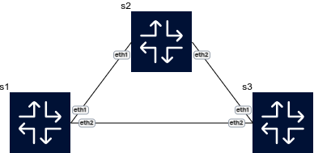

# Configure Per-VLAN Spanning Tree on Arista cEOS

Per-VLAN Spanning Tree (PVST) is a Cisco proprietary protocol that runs a separate instance of the STP for each VLAN. This allows for load balancing of traffic for different VLANs on the same set of links. This guide demonstrates how to configure PVST on Arista cEOS switches using Containerlab.

## 1. Create a network topology

To create a network topology, use the following Containerlab configuration file named `pvst.clab.yml`:

```
name: pvst
topology:
  nodes:
    switch1:
      kind: arista_ceos
      image: takfa19/ceos:4.32.2F
      startup-config: switch.cfg
    switch2:
      kind: arista_ceos
      image: takfa19/ceos:4.32.2F
      startup-config: switch.cfg
  links:
    - endpoints: ["switch1:eth1", "switch2:eth1"]
    - endpoints: ["switch1:eth2", "switch2:eth2"]
```

This topology defines two switches with two redundant links.

Next, create the startup configuration files for the switches.

In the same directory as your YAML file, create a file named `switch.cfg`, which will be used for both switches:

```
!
enable
configure terminal
!
username admin privilege 15 secret admin
!
spanning-tree mode rapid-pvst
!
vlan 10
   name VLAN10
vlan 20
   name VLAN20
!
interface Ethernet1
   switchport mode trunk
   switchport trunk allowed vlan 10,20
   spanning-tree vlan 10 port-priority 64
!
interface Ethernet2
   switchport mode trunk
   switchport trunk allowed vlan 10,20
   spanning-tree vlan 20 port-priority 64
!
end
```

This configuration sets up two VLANs (10 and 20) and enables Rapid PVST. The port priorities are adjusted to 64 so that, for VLAN 10, one link is forwarding while the other is blocking; for VLAN 20, the roles are reversed. The default port priority for PVST is 128, and the lower the number, the higher the priority.

## 2. Deploy and verify the lab

Deploy the topology with the following command:

```
clab deploy -t pvst.clab.yml
```



After the lab is deployed, you can verify the PVST configuration. Access `switch1` and check the spanning tree status for VLAN 10 and VLAN 20.

To access `switch1`, use the following command:

```
docker exec -it clab-pvst-switch1 Cli
```

On `switch1`, you can check the spanning tree status for VLAN 10:

```
show spanning-tree vlan 10
```

And for VLAN 20:

```
show spanning-tree vlan 20
```

## 3. Clean up the lab

When you are finished, you can destroy the lab environment and remove all related files with the following command:

```
clab destroy -t pvst.clab.yml --cleanup
```
