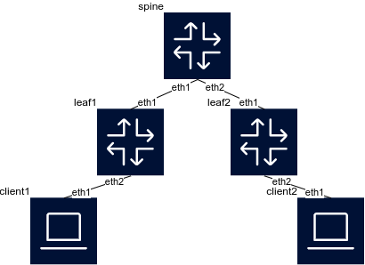

# Configure a static VXLAN on Arista cEOS

VXLAN is a network virtualization technology that enables scalable Layer 2 overlays across Layer 3 infrastructure using UDP encapsulation.

This guide demonstrates how to configure a static VXLAN in a data center topology using Containerlab with Arista cEOS. The lab consists of one spine switch, two leaf switches, and two clients in the same VLAN connected to different leaf switches.

## 1. Create a network topology

To create the spine-leaf topology, you can use the following YAML configuration (`vxlan.clab.yml`):

```
name: vxlan
topology:
  nodes:
    # Spine (Arista cEOS)
    spine:
      kind: arista_ceos
      image: takfa19/ceos:4.32.2F
      startup-config: spine.cfg
    # Leaf 1 (Arista cEOS)
    leaf1:
      kind: arista_ceos
      image: takfa19/ceos:4.32.2F
      startup-config: leaf1.cfg
    # Leaf 2 (Arista cEOS)
    leaf2:
      kind: arista_ceos
      image: takfa19/ceos:4.32.2F
      startup-config: leaf2.cfg
    # Client 1 (Linux container)
    client1:
      kind: linux
      image: alpine:latest
      exec:
        - ip addr add 192.168.10.1/24 dev eth1
    # Client 2 (Linux container)
    client2:
      kind: linux
      image: alpine:latest
      exec:
        - ip addr add 192.168.10.2/24 dev eth1
  links:
    - endpoints: ["spine:eth1", "leaf1:eth1"]
    - endpoints: ["spine:eth2", "leaf2:eth1"]
    - endpoints: ["leaf1:eth2", "client1:eth1"]
    - endpoints: ["leaf2:eth2", "client2:eth1"]
```

This configuration defines the spine and leaf switches, and two clients with static IP addresses.

Next, create the configuration files for the switches.

In the same directory, create a file named `spine.cfg` with the following content:

```
!
enable
configure terminal
!
hostname spine
!
username admin privilege 15 secret admin
!
interface Ethernet1
   no switchport
   ip address 10.0.1.1/30
   ip ospf area 0
!
interface Ethernet2
   no switchport
   ip address 10.0.1.5/30
   ip ospf area 0
!
interface Loopback0
   ip address 3.3.3.3/32
   ip ospf area 0
!
ip routing
!
router ospf 1
   router-id 3.3.3.3
```

Create a file named `leaf1.cfg`:

```
!
enable
configure terminal
!
hostname leaf1
!
username admin privilege 15 secret admin
!
interface Ethernet1
   no switchport
   ip address 10.0.1.2/30
   ip ospf area 0
!
interface Loopback0
   ip address 1.1.1.1/32
   ip ospf area 0
!
ip routing
!
vlan 10
   name VLAN10
!
interface vxlan 1
   vxlan source-interface Loopback0
   vxlan udp-port 4789
   vxlan vlan 10 vni 10010
   vxlan flood vtep 2.2.2.2
!
router ospf 1
   router-id 1.1.1.1
!
interface Ethernet2
   switchport mode access
   switchport access vlan 10
```

In this configuration, leaf1 is set up to use VXLAN with a VNI of 10010, allowing it to encapsulate traffic for VLAN 10. The VXLAN tunnel is established with the leaf2 switch, which acts as the VTEP (VXLAN Tunnel Endpoint).

Finally, create the configuration file for leaf2:

Create a file named `leaf2.cfg`:

```
!
enable
configure terminal
!
hostname leaf2
!
username admin privilege 15 secret admin
!
interface Ethernet1
   no switchport
   ip address 10.0.1.6/30
   ip ospf area 0
!
interface Loopback0
   ip address 2.2.2.2/32
   ip ospf area 0
!
ip routing
!
vlan 10
   name VLAN10
!
interface vxlan 1
   vxlan source-interface Loopback0
   vxlan udp-port 4789
   vxlan vlan 10 vni 10010
   vxlan flood vtep 1.1.1.1
!
router ospf 1
   router-id 2.2.2.2
!
interface Ethernet2
   switchport mode access
   switchport access vlan 10
```

In this configuration, leaf1 is also set up to use VXLAN with a VNI of 10010, allowing it to encapsulate traffic for VLAN 10. The VXLAN tunnel is established with the leaf1 switch, which acts as the VTEP.

## 2. Deploy the network topology

To deploy the network topology, run the following command:

```
clab deploy -t vxlan.clab.yml
```



After the lab is deployed, you can test connectivity between the clients. Open a new terminal and connect to client1:

```
docker exec -it clab-vxlan-client1 sh
```

Ping client2 to test the VXLAN tunnel:

```
ping 192.168.10.2
```

To access the switches:

```
ssh clab-vxlan-leaf1
```

```
ssh clab-vxlan-leaf2
```

```
ssh clab-vxlan-spine
```

Verify the VXLAN tunnel status on the leaf switches:

```
show vxlan vni
```

```
show vxlan address-table
```

## 3. Clean up the lab

After testing, you can clean up the lab environment. To remove the lab and all related files, run:

```
clab destroy -t vxlan.clab.yml --cleanup
```
